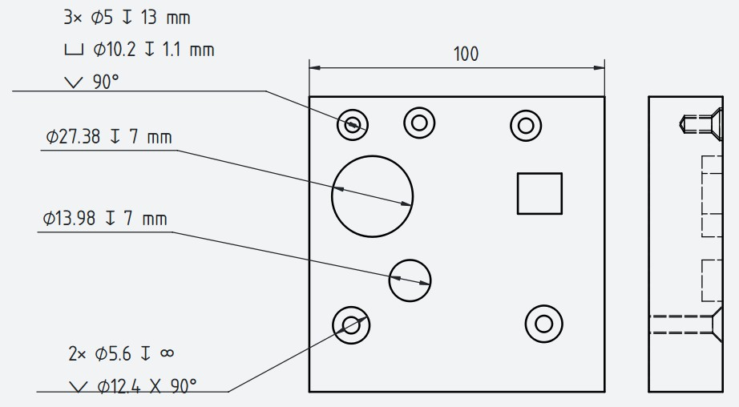

# Hole Callout — FreeCAD Macro

A FreeCAD macro that links a **TechDraw diameter dimension** to a **PartDesign Hole or Pocket** feature and keeps the callout text automatically in sync with the model.

---

## Screenshot



The screenshot shows a typical TechDraw drawing with several callout types generated by the macro:

- **`3× ⌀5 ↧ 13 mm`** — three countersunk holes (ISO countersink), with counterbore `⌴ ⌀10.2 ↧ 1.1 mm` and countersink angle `⌵ 90°`
- **`⌀27.38 ↧ 7 mm`** — a large plain Pocket hole; diameter read directly from the dimension placed on the edge
- **`⌀13.98 ↧ 7 mm`** — a smaller plain Pocket hole, independently linked to its own dimension
- **`2× ⌀5.6 ↧ ∞`** — two through-all countersunk holes; depth shown as ∞, followed by `⌵ ⌀12.4 X 90°`

All callout texts are generated and maintained automatically — editing any feature parameter updates the drawing instantly.

---

## Features

- **Auto-generated callout text** — diameter, depth, thread designation, counterbore, countersink and counterdrill are all formatted automatically from the feature parameters
- **Live updates** — the dimension text updates immediately whenever the linked Hole or Pocket is modified, with no manual intervention required
- **Persistent bindings** — links are saved inside the FreeCAD document; run the macro after reopening a file to restore all observers in one click
- **Automatic cleanup** — stale bindings (from deleted features or dimensions) are detected and removed automatically
- **ISO style applied automatically** — FlipArrowheads, ISO Referencing drawing style and hidden units are set on every linked dimension
- **Supports multiple standards** — ISO metric, ISO metric fine, UNC, UNF, UNEF, NPT, NPTF, BSP, BSP pipe threads
- **Counterbore / countersink / counterdrill** — correct symbols and values for all standard head types (Counterbore, Countersink, Counterdrill, ISO 10642, ISO 14583, ISO 4762, DIN 7984, ISO 2009, ISO 7046, and more)
- **Thread class** — tolerance class is shown for tapped holes and hidden for clearance / passthrough holes
- **Through-all holes** — depth displayed as ∞ symbol for both Hole and Pocket features

---

## Callout format examples

| Hole type | Example output |
|---|---|
| Plain hole | `⌀6 ↧ 12 mm` |
| Through-all hole | `⌀6 ↧ ∞` |
| Multiple instances | `3× ⌀6 ↧ 12 mm` |
| Tapped hole | `M6x1.0 - 6H ↧ 15 mm` |
| Clearance hole | `M6x1.0 ↧ ∞` |
| Counterbore | `⌀6 ↧ 20 mm`<br>`⌴ ⌀12 ↧ 7 mm` |
| Countersink | `⌀6 ↧ ∞`<br>`⌵ ⌀12 X 90°` |
| Counterdrill | `⌀6 ↧ 18 mm`<br>`⌴ ⌀10.2 ↧ 2.1 mm`<br>`⌵ 90°` |
| Pocket | `⌀15.2 ↧ 5 mm` |
| Pocket through-all | `⌀15.2 ↧ ∞` |

---

## Requirements

- FreeCAD **≥ 0.21**
- Workbenches: **PartDesign** (for Hole / Pocket features), **TechDraw** (for dimensions)

---

## Installation

1. Download `Hole_Callout.FCMacro`
2. Copy it to your FreeCAD **Macro directory**
   - Find the path via: `Edit → Preferences → General → Macro path`
   - Default on Windows: `C:\Users\<user>\AppData\Roaming\FreeCAD\Macro`
3. Run the macro once — it will automatically save `Hole_Callout_icon.svg` alongside the macro file

### Add a toolbar button (recommended, one-time setup)

1. Run the macro at least once so the icon file is created
2. Open **Tools → Customize → Macros**
3. Click **Add**, then set:
   - **Macro**: `Hole_Callout.FCMacro`
   - **Menu text**: `HoleDimension`
   - **Tooltip**: `Link a TechDraw dimension to a Hole/Pocket feature`
   - **Icon**: click `...` and select `Hole_Callout_icon.svg` from the Macro directory
4. Click **Add** to confirm
5. Switch to **Tools → Customize → Toolbars**
6. Set **Category** to `Macros`, then drag `HoleDimension` into a toolbar of your choice
7. Click **Close** and restart FreeCAD

The button is now permanently available in the toolbar.

---

## Usage

### Mode 1 — Link a dimension to a feature

1. In TechDraw, create a **diameter dimension** on a hole edge (use the standard TechDraw diameter tool)
2. In the model tree or the view, **select both** the dimension and the Hole / Pocket feature (hold **Ctrl** for multi-select)
3. Click the **HoleDimension** toolbar button or run the macro

The dimension text is updated immediately and will keep updating automatically whenever the feature changes.

### Mode 2 — Restore observers after FreeCAD restart

Observers are session-only objects — they are lost when FreeCAD closes. Bindings, however, are saved inside the document.

1. Open your document
2. Click the **HoleDimension** button with **nothing selected**

All previously saved bindings are restored in one step. Any stale bindings (pointing to deleted objects) are cleaned up automatically.

---

## How it works

```
Select dimension + Hole/Pocket
         │
         ▼
   link_dimension()
   ┌─────────────────────────────────┐
   │ • reads feature parameters      │
   │ • builds callout text           │
   │ • applies ISO dimension style   │
   │ • writes FormatSpec             │
   │ • saves binding in document     │
   │ • registers live observer       │
   └─────────────────────────────────┘
         │
         ▼
   HoleDimensionObserver (active for session)
   ┌─────────────────────────────────┐
   │ • watches slotChangedObject     │
   │ • watches slotRecomputedObject  │
   │ • updates FormatSpec on change  │
   └─────────────────────────────────┘

On next FreeCAD open:
   run macro with nothing selected
         │
         ▼
   restore_observers()
   reads JSON bindings from document → re-registers all observers
```

Bindings are stored as a JSON string in a hidden document property (`HoleDimensionBindings`), so they travel with the `.FCStd` file.

---

## Supported hole cut types

| Standard | Treatment |
|---|---|
| `Counterbore` | Cylindrical — depth shown, angle ignored |
| `DIN 7984` | Cylindrical — depth shown, angle ignored |
| `ISO 14583`, `ISO 14583 (partial)` | Cylindrical — depth shown, angle ignored |
| `ISO 4762`, `ISO 4762 + 7089` | Cylindrical — depth shown, angle ignored |
| `Countersink` | Conical — diameter × angle shown |
| `ISO 10642` | Conical — diameter × angle shown |
| `ISO 2009` | Conical — diameter × angle shown |
| `ISO 7046` | Conical — diameter × angle shown |
| `Counterdrill` | Cylindrical bore + cone angle |

---

## Dimension style applied automatically

| Property | Value set |
|---|---|
| `Arbitrary` | `True` (enables custom text) |
| `ShowUnits` | `False` |
| `EqualTolerance` | `True` |
| `FlipArrowheads` | `True` |
| `StandardAndStyle` | `ISO Referencing` |

---

## Known limitations

- Observers are **session-only** — clicking the toolbar button after reopening a document is required to restore them (one click, no selection needed)
- Only **diameter dimensions** (`Type = Diameter`) are supported; linking to linear, angular or radius dimensions is rejected with an error message
- For **Pocket** features, the diameter is read from the TechDraw dimension geometry reference, not from the sketch — this means the diameter shown reflects the dimension placed by the user on a specific edge
- Instance counting (e.g. `3×`) works for `PartDesign::Hole` features only; Pocket features always show a single count

---

## License

LGPL-2.0-or-later — see [LICENSE](LICENSE)

---

## Author

Grzegorz Ginalski
